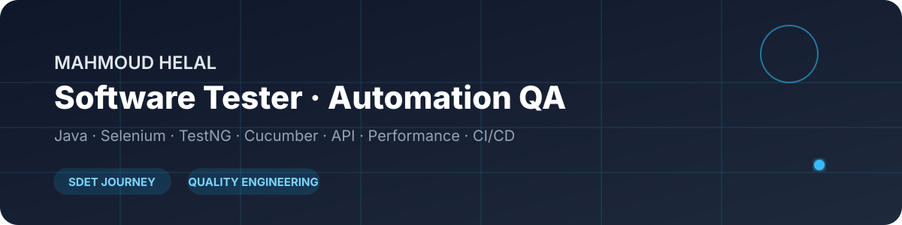

<div align="center">



### Software Tester · Automation QA Engineer

**ISTQB CTFL · Java · Selenium · TestNG · Cucumber · API · Performance · CI/CD**

[](https://github.com/MahmodHelal)
[](https://www.istqb.org/)

</div>

---

## 👋 About Me

I am a **Software Tester and Automation QA Engineer** with hands-on experience across manual testing and UI automation, focused on building reliable, maintainable quality practices and growing toward **SDET / Quality Engineering**.

My portfolio focuses on Java/Selenium automation, TestNG, Cucumber BDD, API testing, SQL/database validation, performance testing, and practical end-to-end QA workflows.

## 🧰 Technical Stack

| Area | Technologies |
|---|---|
| **Languages** | Java, SQL |
| **UI Automation** | Selenium WebDriver, TestNG, Cucumber BDD, POM |
| **API Testing** | Postman, Newman, REST API testing |
| **Performance** | JMeter, Locust |
| **Test Management** | Jira, Xray, Azure DevOps |
| **Build & Version Control** | Maven, Git, GitHub |
| **Development** | IntelliJ IDEA |

## 🧪 QA & Testing

- Functional, regression, system, acceptance, and end-to-end testing
- Test scenario and test-case design
- Defect identification, reporting, and verification
- UI and API testing
- SQL / database validation
- Automation framework design with Page Object Model
- BDD with Gherkin and Cucumber
- Performance testing and basic performance analysis
- Test execution, reporting, and quality documentation

## 🚀 Featured Automation Work

### [Royal Grant Automation](https://github.com/MahmodHelal/Royal-Grant-Automation)

**Java · Selenium WebDriver · Cucumber · TestNG · Maven · POM · Allure**

End-to-end automation of a multi-stage grant workflow with reusable Page Objects, Cucumber scenarios, TestNG execution, configuration, reporting, and cross-step transaction handling.

### [CRM Automation Test Suite](https://github.com/MahmodHelal/CRM-Automation-Test)

**Java · Selenium WebDriver · TestNG · Maven · POM**

UI automation focused on authentication, navigation, business-data workflows, form validation, positive/negative scenarios, test-data handling, and regression-oriented coverage.

### [nopCommerce E-Commerce Test Automation](https://github.com/MahmodHelal/Amit_52proj)

**Java · Selenium WebDriver · Cucumber · TestNG · Maven**

A BDD-oriented e-commerce automation project covering registration, product search, cart, and checkout journeys.

## 🎯 Career Direction

```text
Software Testing
      ↓
Test Automation
      ↓
Automation Architecture
      ↓
API + Performance + CI/CD
      ↓
SDET / Quality Engineering
```

Current learning direction includes **modern browser automation, TypeScript, stronger automation architecture, API automation, CI/CD, performance engineering, and AI-assisted testing**.

## 📜 Certification

**ISTQB Certified Tester — Foundation Level (CTFL v4.0)**

## 🤝 Let's Connect

Open to opportunities and professional conversations around **Software Testing, Automation QA, SDET, and Quality Engineering**.

<div align="center">

**Quality is not only about finding bugs — it is about building confidence in software.**

</div>
